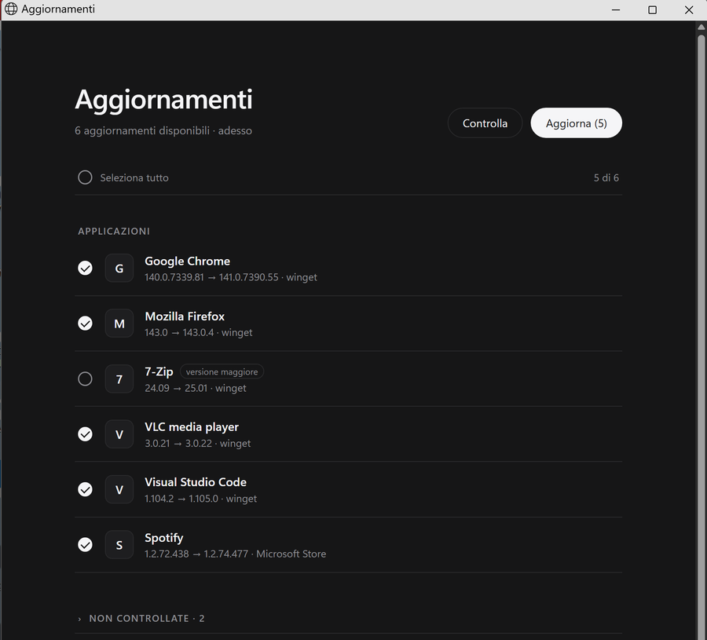
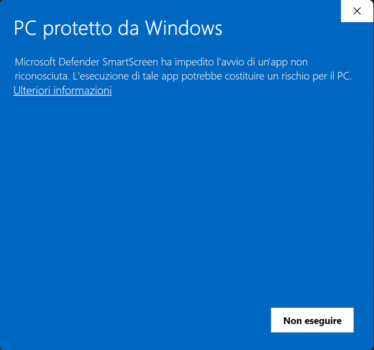

# Aggiornamenti per Windows

**Tiene aggiornati tutti i programmi del tuo PC con un clic.** Apri Aggiornamenti, vedi quali programmi hanno una versione nuova e li aggiorni tutti insieme, senza dover aprire i siti dei produttori uno per uno. È gratuito, senza pubblicità e senza account.

[English version →](README.en.md)



---

## Installazione (3 minuti)

### 1. Scarica il programma

👉 **[Scarica Aggiornamenti](https://github.com/giuseppelupo1979/aggiornamenti-windows/releases/latest/download/Aggiornamenti-x64.exe)**: va bene per quasi tutti i PC.

Solo se il tuo PC ha un processore ARM (per esempio Surface Pro X o i portatili Copilot+ con Snapdragon) usa invece **[questa versione](https://github.com/giuseppelupo1979/aggiornamenti-windows/releases/latest/download/Aggiornamenti-arm64.exe)**. Se non sai quale hai: *Start → Impostazioni → Sistema → Informazioni → Tipo di sistema*. Se c'è scritto "x64", usa il primo link.

### 2. Apri il file scaricato

Apri **Aggiornamenti** dalla cartella Download (o dalla barra di download del browser).

La prima volta Windows mostra quasi sicuramente una schermata blu **"PC protetto da Windows"**. È normale: compare con tutti i programmi nuovi che non sono firmati da un'azienda con un certificato a pagamento. Per proseguire:

1. clicca la scritta **Ulteriori informazioni**;
2. in basso compare un nuovo pulsante, **Esegui comunque**: cliccalo.



### 3. Fatto

Si apre la finestra di Aggiornamenti e parte subito il controllo. Il programma si è già installato da solo: lo ritrovi nel **menu Start** e sul **Desktop**, puoi cancellare il file dalla cartella Download.

### Consigliato: attiva i privilegi di amministratore

Molti programmi, per aggiornarsi, chiedono a Windows il permesso dell'amministratore ("Vuoi consentire a questa app di apportare modifiche?"). Per non dover rispondere ogni volta:

1. in fondo alla finestra apri **Privilegi di amministratore non attivi**;
2. premi **Attiva** e rispondi **Sì** a Windows, una volta sola.

Da quel momento gli aggiornamenti si installano in silenzio e Aggiornamenti parte da solo all'accensione del PC per fare il controllo quotidiano.

---

## Come si usa

- **Clicca sui programmi** da aggiornare, oppure su **Seleziona tutto**, poi premi **Aggiorna**. Una barra mostra cosa sta succedendo per ogni programma.
- I programmi segnati **versione maggiore** (un grande salto di versione) non vengono selezionati da soli: aggiornali solo se sai che ti serve.
- Passando sopra un programma compare **Escludi**: non verrà più proposto. Lo ritrovi in fondo, nella sezione *Escluse*.
- In **Controllo automatico** puoi farti avvisare ogni giorno con una notifica, oppure lasciare che aggiorni tutto da solo di notte.
- Quando esce una nuova versione di Aggiornamenti stesso, compare un riquadro in alto con il pulsante **Installa**.

---

## Domande frequenti

**È sicuro?**
Il programma usa **winget**, lo strumento ufficiale di Microsoft già incluso in Windows 11, che scarica ogni aggiornamento dal sito del produttore e ne verifica l'integrità. Il codice di Aggiornamenti è pubblico in questa pagina e il file che scarichi viene costruito direttamente da GitHub a partire da questo codice.

**Perché Windows mostra "PC protetto da Windows"?**
Perché il programma è nuovo e non è firmato con un certificato a pagamento. Non significa che sia pericoloso: Windows avvisa per ogni programma che non conosce ancora. L'avviso diminuisce man mano che il programma viene scaricato da più persone.

**L'antivirus lo segnala.**
Alcuni antivirus segnalano per errore i programmi creati con lo strumento usato qui (PyInstaller). Se succede, puoi verificare che il file sia quello originale confrontando il codice SHA-256 pubblicato nella pagina della [versione](https://github.com/giuseppelupo1979/aggiornamenti-windows/releases/latest).

**Manda dati a qualcuno?**
No. Tutto funziona sul tuo PC. Le uniche connessioni sono quelle necessarie per controllare e scaricare gli aggiornamenti (i server di Microsoft e dei produttori) e, ogni sei ore, una richiesta a GitHub per sapere se esiste una nuova versione di Aggiornamenti. Niente account, niente pubblicità, niente statistiche.

**Alcuni programmi non compaiono.**
Aggiornamenti vede i programmi che winget conosce, cioè la grande maggioranza. Quelli che non riesce a controllare sono elencati in fondo, in *Non controllate*: per quelli usa l'aggiornamento interno del programma. Microsoft Edge non compare perché si aggiorna già da solo.

**Un aggiornamento è "Non riuscito".**
Cliccaci sopra per vedere il motivo. I casi più comuni: hai risposto *No* alla richiesta di Windows, oppure il programma era aperto. Chiudilo e riprova.

**Funziona su Windows 10?**
È provato su Windows 11. Su Windows 10 funziona se è installato *Programma di installazione app* (winget) dal Microsoft Store.

**Come lo disinstallo?**
*Start → Impostazioni → App → App installate → Aggiornamenti → Disinstalla*.

---

## Per chi vuole saperne di più

Aggiornamenti è un piccolo server locale (Python, solo libreria standard) che usa winget per trovare e installare gli aggiornamenti, con un'interfaccia web mostrata in una finestra di Microsoft Edge in modalità applicazione. Ascolta solo su `127.0.0.1` e rifiuta richieste da altri siti. Gli exe per x64 e ARM64 sono costruiti da [GitHub Actions](.github/workflows/build.yml) a ogni versione.

Avvio dal sorgente, senza exe:

```powershell
git clone https://github.com/giuseppelupo1979/aggiornamenti-windows.git
cd aggiornamenti-windows
.\installa.ps1
```

Esiste anche la versione per Mac: [aggiornamenti-mac](https://github.com/giuseppelupo1979/aggiornamenti-mac). Le novità di ogni versione sono in [CHANGELOG.md](CHANGELOG.md).

## Licenza

[MIT](LICENSE): libero da usare, modificare e condividere. Il software è fornito **senza garanzia**: installa e aggiorna programmi sul tuo PC, quindi lo usi a tuo rischio, come qualsiasi strumento di sistema.

Realizzato da Giuseppe Lupo con Claude (Anthropic).
